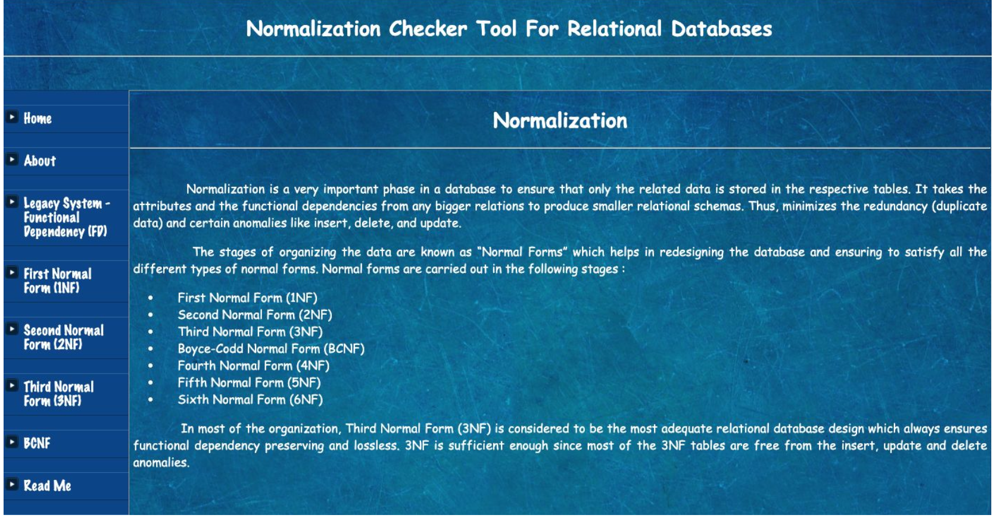

# Normalization-Checker-Tool-for-Relational-Databases

Normalization is the most applied technique for the consideration of relational databases. It aims at creating a set of relations with minimum data redundancy that preserve consistency and simplify the appropriate insertion, deletion, and modification. A normalized database does not show any anomalies in future updates. It’s a very time-consuming process when it is done manually which affects the productivity of any organization. Thus, an automated Normalization tool for relational databases is proposed to aid in automating the relational database schema normalization up to BCNF form. This tool mainly concentrates on addressing the legacy system issues where we will be unaware of the physical design behind the system. It’s always a challenging problem to identify the dependencies among the attributes when the system is outdated, yet still in use. 

## Normalization Tool Snapshot

Note : Check the Readme File in the Project Code to how to use this tool
